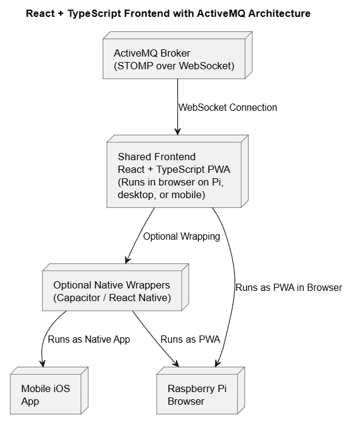

# PiTrac Client
- [Summary](#summary)
    - [Architecture](#architecture)
- [PreRequisites & Library Versions ](#prerequisites--library-versions)
- [Getting Started](#getting-started)
## Summary 

Complete Modern Open Source PiTrac Client Alternative using React, Stomp, ActiveMQ WebSockets. The intent is to then wrap this in a mobile app, while keeping a local UI solution on the Raspberry Pi.

### Architecture

### PreRequisites & Library Versions 

This project uses the following: 

- PlantUML (install this extension on Visual Code)
- React ^18.2.0
- NPM ^10.8.2
- react-dom ^18.2.0
- typescript ^5.0.4
- @stom/stompjs ^7.0.0
- @types/react ^18.0.28
- @types/react-dom ^18.0.11

### Getting Started

1. Start with installing NPM and Node in Rapsberry Pi OS `curl -fsSL https://deb.nodesource.com/setup_18.x | sudo -E bash -
sudo apt install -y nodejs`

2. Second, install all libraries inside the `npm install`. This should automatically install all required libraries from package.json, including Stomp. 

